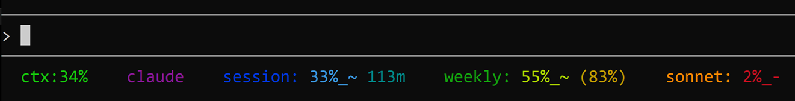

# Claude Code Status Line

A custom status line for [Claude Code](https://docs.anthropic.com/en/docs/claude-code) that displays context window usage, directory and git branch, API quota burn rates, and active model — with a cool-to-warm color gradient across 11 color stops.

As of v2.0, this script uses **native rate limit data** from Claude Code 2.1.80+ instead of polling the Anthropic API via ccburn. This eliminates API rate limiting issues and cache staleness — data updates on every render cycle. **ccburn is no longer a dependency or recommended approach** — everything it provided is now available directly in the Claude Code status line JSON.



## What it shows

| Section | Description |
|---------|-------------|
| **ctx** | Context window usage. Dynamic color: blue (<60%), yellow (60-84%), red (85%+) |
| **location** | Directory name with git branch (`dir@branch`), or just directory name if not in a repo |
| **session** | 5-hour rolling window utilization (native from Claude Code) |
| **reset timer** | Minutes until session window resets |
| **weekly** | 7-day rolling window utilization (native from Claude Code) |
| **time elapsed** | % of your weekly budget window that has elapsed (see below) |
| **model** | Active model short name (e.g. `opus-4-6`, `sonnet-4-6`) |
| **effort** | Effort level from `~/.claude/settings.json` (e.g. `[high]`, `[low]`) — omitted if not set |

Pace indicators after each quota value: `~` = behind pace (good), `=` = on pace, `!` = ahead of pace (watch it).

### How pace works

Pace compares your usage to the elapsed time in the window. If 50% of the 5-hour session window has passed and you've used 30% of your budget, you're behind pace (`~`) — that's good.

The thresholds are: below 85% of expected = behind (`~`), 85-115% = on pace (`=`), above 115% = ahead (`!`).

### Weekly time elapsed

The `(NN%)` value after the weekly quota shows how much of the 7-day window has passed. Compare it to the weekly quota percentage to quickly gauge pacing.

For example, `weekly: 30%_~ (50%)` means you've used 30% of your budget but 50% of the week has passed — you're pacing well.

## Requirements

- **Claude Code 2.1.80+** — earlier versions don't include `rate_limits` in the status line JSON
- [jq](https://jqlang.github.io/jq/) — JSON processor (most systems have this already)
- A terminal that supports ANSI colors and 256-color mode (Windows Terminal, iTerm2, most Linux terminals)

## Installation

1. **Copy the script** to your Claude Code config directory:
   ```bash
   cp statusline-command.sh ~/.claude/statusline-command.sh
   chmod +x ~/.claude/statusline-command.sh
   ```

2. **Configure Claude Code** to use it. Add this to `~/.claude/settings.json`:
   ```json
   {
     "statusLine": {
       "type": "command",
       "command": "bash ~/.claude/statusline-command.sh"
     }
   }
   ```

3. **Restart Claude Code** to pick up the new status line.

## Configuration

Edit the variables at the top of `statusline-command.sh`:

### jq path

If `jq` is on your PATH, the default works. Otherwise, set the full path:

```bash
JQ="/usr/local/bin/jq"
```

## Customizing colors

The color assignments are in the `ANSI gradient` section. 11 stops flow cool-to-warm left to right:

```bash
C1=$'\033[38;5;63m'    # ctx label
C2=$'\033[38;5;69m'    # ctx value (below 60%)
C3=$'\033[38;5;75m'    # location
C4=$'\033[38;5;80m'    # session label
C5=$'\033[38;5;43m'    # session value
C6=$'\033[38;5;114m'   # session timer
C7=$'\033[38;5;150m'   # weekly label
C8=$'\033[38;5;186m'   # weekly value
C9=$'\033[38;5;222m'   # weekly time%
C10=$'\033[38;5;209m'  # model
C11=$'\033[38;5;203m'  # effort
CTX_YELLOW=$'\033[38;5;220m'  # ctx value at 60-84%
CTX_RED=$'\033[38;5;196m'     # ctx value at 85%+
```

All values use 256-color (`38;5;N`) codes — supported by any modern terminal (Windows Terminal, iTerm2, most Linux terminals).

## Without rate limit data

The script degrades gracefully. On Claude Code versions before 2.1.80 (which don't include `rate_limits` in the status line JSON), only the context percentage and git branch are shown:

```
ctx:42%    myproject@main
```

## How it works

Claude Code pipes JSON to the status line command via stdin on each render cycle. Starting with Claude Code 2.1.80, this JSON includes a `rate_limits` object with `five_hour` and `seven_day` windows, each containing `used_percentage` and `resets_at` (Unix timestamp).

The script computes pace by comparing usage against elapsed time in each window, and derives the countdown timer from `resets_at - now`. All values are real-time — no caching, no API polling, no stale data.

### Expired window handling

When `resets_at` is in the past (window has expired but Claude Code hasn't updated yet), the script overrides the display to 0% to avoid showing misleading high-usage numbers at the start of a fresh window.

### Migration from ccburn

Previous versions of this script (v1.x) used [ccburn](https://github.com/JuanjoFuchs/ccburn) to poll the Anthropic usage API for rate limit data. **ccburn is fully deprecated for this purpose** — Claude Code 2.1.80+ provides the same data natively in the status line JSON, with no API calls, no caching, and no stale data.

If you're upgrading from a ccburn-based script:

- Remove the ccburn-related configuration (`CCBURN`, `CACHE_FILE`, `CACHE_MAX_AGE`, `RL_FLAG`, `RESET_DAY`, `RESET_HOUR`)
- ccburn is no longer a dependency (you can keep it installed if you use its standalone TUI)
- The cache file (`~/.claude/.ccburn-cache`) and rate limit sentinel (`~/.claude/.ccburn-ratelimited`) are no longer used

## License

MIT
